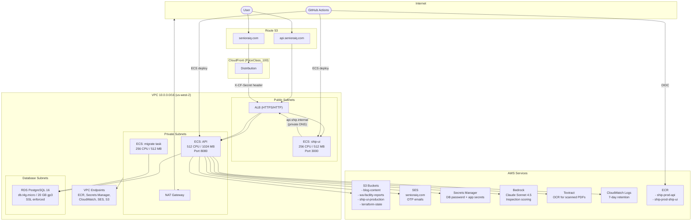

# SHIP AWS Infrastructure

**Region:** `us-west-2` (primary), `us-east-1` (CloudFront cert, billing alarms)
**Domain:** `senioraiq.com`
**Terraform State:** S3 + DynamoDB locking, split across two state files (backend, frontend)

## Architecture Diagram

## Service Inventory

| Service | Resource | Details |
|---------|----------|---------|
| **VPC** | 1 VPC, 6 subnets, 1 NAT GW | 2 AZs, public/private subnets (database subnets retained until RDS replacement) |
| **ECS Fargate** | 1 cluster, 2 services, 1 task | API (1 task), ship-ui (1-3 tasks, autoscaling), migrate (on-demand) |
| **ALB** | 1 load balancer | HTTPS termination, routes API + ship-ui via header matching |
| **RDS** | 1 PostgreSQL 16 instance | db.t4g.micro, 20 GB gp3, single-AZ, 7-day backups, SSL enforced, not publicly accessible |
| **CloudFront** | 1 distribution | senioraiq.com + www, OAC to S3, origin secret to ALB |
| **S3** | 4 buckets | Blog content, facility reports, static assets, terraform state |
| **ECR** | 2 repositories | API + ship-ui images, lifecycle keeps last 10 |
| **SES** | 1 domain identity | DKIM verified, mail-from subdomain, OTP delivery |
| **Secrets Manager** | 2 secrets | DB password, app secrets (SES, Bedrock, GitHub) |
| **Bedrock** | Claude Sonnet 4.5 | Inspection report scoring via InvokeModel |
| **Textract** | DetectDocumentText | OCR fallback for scanned PDFs |
| **Route 53** | 1 public + 1 private zone | DNS for domain + internal service discovery |
| **ACM** | 2 certificates | ALB (us-west-2), CloudFront (us-east-1) |
| **CloudWatch** | 3 log groups, 1 billing alarm | 7-day retention, Textract spend alert at $20 |
| **DynamoDB** | 1 table | Terraform state locking (pay-per-request) |
| **VPC Endpoints** | 5 interface + 1 gateway | ECR, Secrets Manager, CloudWatch, SES, S3 |
| **IAM** | OIDC provider + 2 GH Actions roles | No long-lived access keys |

## Not Yet Deployed

| Service | Status | Notes |
|---------|--------|-------|
| **Lambda** | Terraform commented out | Planned for DSHS, Reviews, Assessor, Location agents |
| **ElastiCache Redis** | Terraform commented out | Planned as cache.t4g.micro, Redis 7.0 |

## Where the Costs Are

Estimated monthly costs ranked by spend. All instances are minimal tier.

| Service | Est. Monthly | Notes |
|---------|-------------|-------|
| **NAT Gateway** | ~$32 + data | $0.045/hr fixed + $0.045/GB processed. Biggest fixed cost. |
| **RDS** (db.t4g.micro) | ~$12-15 | On-demand pricing. Could save ~40% with reserved instance. |
| **ECS Fargate** (3 tasks) | ~$12-18 | ARM pricing: API (512/1024) + ship-ui (256/512) + occasional migrate |
| **ALB** | ~$16 + LCU | $0.0225/hr fixed + per-LCU charges. Low traffic = minimal LCU. |
| **VPC Endpoints** (5 interface) | ~$36 | $0.01/hr each x 5 = ~$36/mo. Consider consolidating or removing. |
| **CloudFront** | ~$1-5 | PriceClass_100, low traffic. First 1 TB free. |
| **S3** | <$1 | Minimal storage, low request volume |
| **Secrets Manager** | ~$1 | $0.40/secret/month x 2 |
| **Route 53** | ~$1-2 | $0.50/zone x 2 + queries |
| **SES** | <$1 | $0.10 per 1K emails, low volume |
| **ECR** | <$1 | 500 MB free, lifecycle cleanup |
| **Bedrock** | Variable | Pay-per-token, depends on scoring volume |
| **Textract** | Variable | $1.50/1K pages, alarm at $20/mo |
| **CloudWatch** | <$1 | 7-day retention, minimal log volume |
| **DynamoDB** | ~$0 | Pay-per-request, only during terraform runs |
| **ACM** | Free | Public certificates are free |

**Estimated total: ~$115-130/mo** at low traffic (excluding variable Bedrock/Textract usage).

### Cost Optimization Opportunities

- **VPC Endpoints ($36/mo):** Five interface endpoints at ~$7/mo each. Evaluate if all are needed — the S3 gateway endpoint is free, but the interface endpoints for ECR, Secrets Manager, CloudWatch, and SES add up. If NAT Gateway is already present, some endpoints are redundant.
- **NAT Gateway ($32+/mo):** Single biggest fixed cost. No easy alternative if private subnets need internet access, but worth auditing actual data transfer.
- **RDS Reserved Instance:** A 1-year no-upfront reserved db.t4g.micro would cut the RDS cost by ~40%.
- **ALB consolidation:** Already shared between API and ship-ui, which is good.

## CI/CD

Both repos deploy on push to `main` via GitHub Actions:

1. Build Docker image (linux/arm64) and push to ECR
2. Register new ECS task definition
3. API: run migration task, then update service
4. Ship-UI: update service directly
5. Auto-tag + GitHub release

Authentication uses OIDC (no stored AWS credentials).

## Security Posture

- RDS publicly_accessible=false, SSL enforced, admin IP allowlisted via Terraform variable (admin_cidr)
- ECS API in private subnets, behind ALB
- ECS ship-ui in public subnets with public IP (needs direct ALB connectivity)
- CloudFront origin secret prevents direct ALB access to ship-ui
- All S3 buckets block public access
- Secrets in Secrets Manager, injected at task launch
- OIDC for CI/CD, no long-lived IAM keys
- VPC endpoints keep AWS API traffic off the public internet
