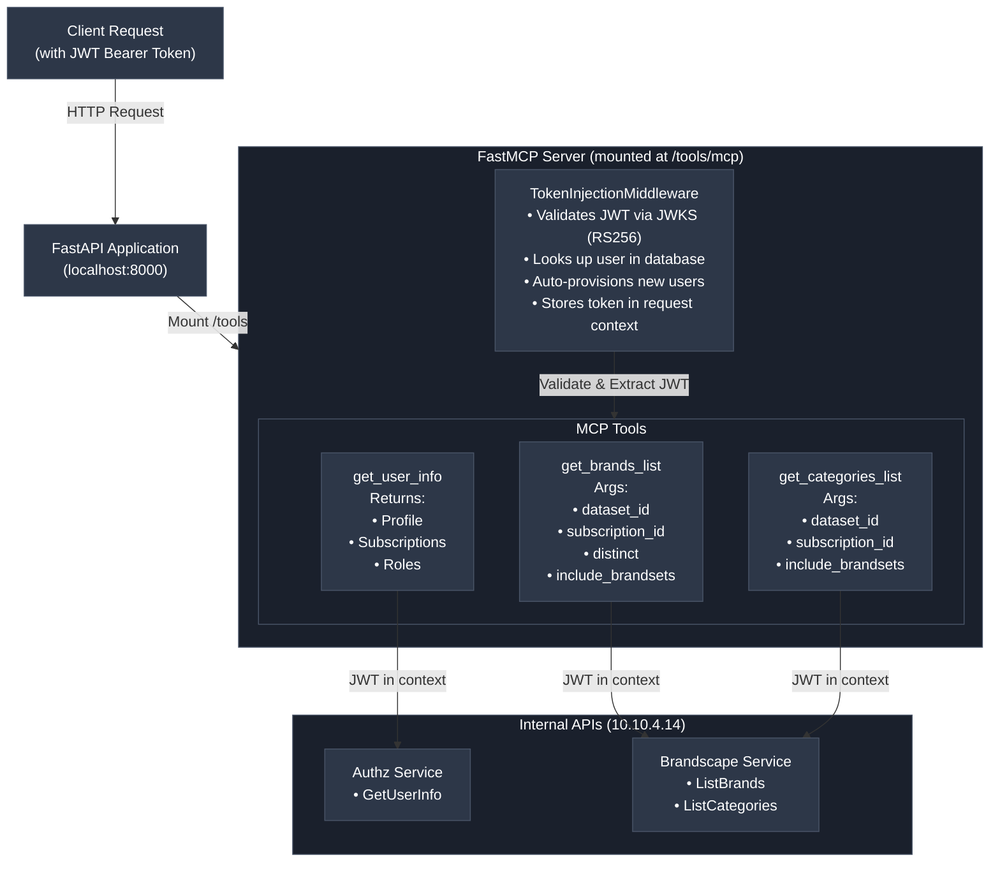

```mermaid
flowchart TD
    Client["Client Request<br/>(with JWT Bearer Token)"]

    FastAPI["FastAPI Application<br/>(localhost:8000)"]

    subgraph MCP["FastMCP Server (mounted at /tools/mcp)"]
        Middleware["TokenInjectionMiddleware<br/>• Validates JWT via JWKS (RS256)<br/>• Looks up user in database<br/>• Auto-provisions new users<br/>• Stores token in request context"]

        subgraph Tools["MCP Tools"]
            Tool1["get_user_info<br/>Returns:<br/>• Profile<br/>• Subscriptions<br/>• Roles"]
            Tool2["get_brands_list<br/>Args:<br/>• dataset_id<br/>• subscription_id<br/>• distinct<br/>• include_brandsets"]
            Tool3["get_categories_list<br/>Args:<br/>• dataset_id<br/>• subscription_id<br/>• include_brandsets"]
        end
    end

    subgraph APIs["Internal APIs (10.10.4.14)"]
        Authz["Authz Service<br/>• GetUserInfo"]
        Brandscape["Brandscape Service<br/>• ListBrands<br/>• ListCategories"]
    end

    Client -->|HTTP Request| FastAPI
    FastAPI -->|Mount /tools| MCP
    Middleware -->|Validate & Extract JWT| Tools
    Tool1 -->|JWT in context| Authz
    Tool2 -->|JWT in context| Brandscape
    Tool3 -->|JWT in context| Brandscape

    style Client fill:#2d3748,stroke:#4a5568,color:#fff
    style FastAPI fill:#2d3748,stroke:#4a5568,color:#fff
    style MCP fill:#1a202c,stroke:#4a5568,color:#fff
    style Middleware fill:#2d3748,stroke:#4a5568,color:#fff
    style Tools fill:#1a202c,stroke:#4a5568,color:#fff
    style APIs fill:#1a202c,stroke:#4a5568,color:#fff
    style Tool1 fill:#2d3748,stroke:#4a5568,color:#fff
    style Tool2 fill:#2d3748,stroke:#4a5568,color:#fff
    style Tool3 fill:#2d3748,stroke:#4a5568,color:#fff
    style Authz fill:#2d3748,stroke:#4a5568,color:#fff
    style Brandscape fill:#2d3748,stroke:#4a5568,color:#fff
```
